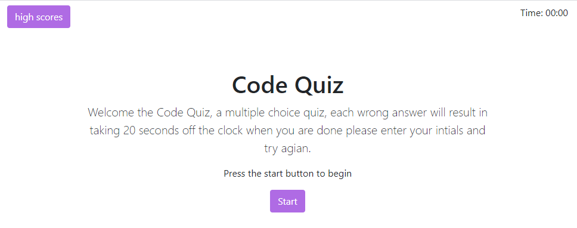
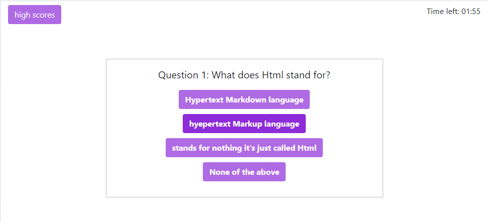
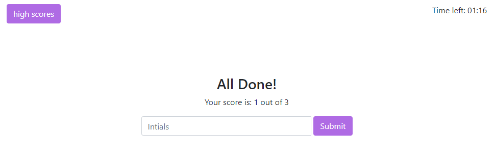
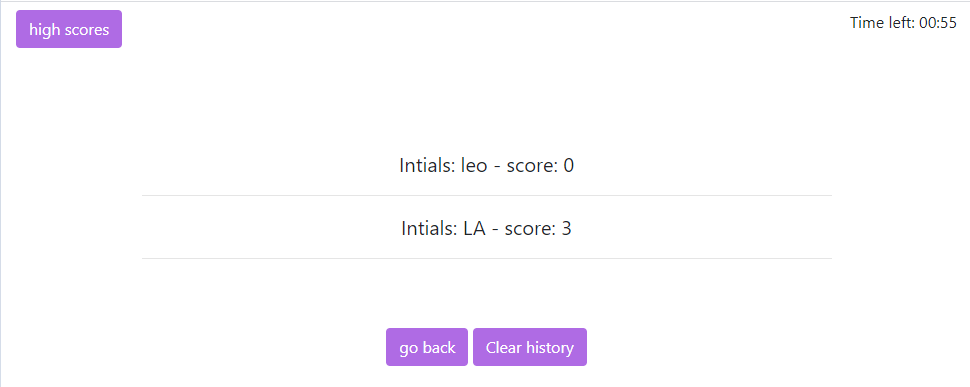

# code-quiz

this is a readme file expalining the step to participate in the quiz

in the main screen you can click the start button to start the quiz or click the socre button to see you past results if any.

once you begin the quiz you have a limited amount of time to answer all the questions.

if you fail to answer the question corectly you will lose 20 seconds frome the clock, one the time is over or you manage to answer all the  questions.
you will be presented with a gameover screen to put in your intials and submit you score.

after that you can go back and try the quizz one more time.

vist ["code quiz"](https://laithalwani.github.io/code-quiz) to give it a try.

This website uses an MIT license.